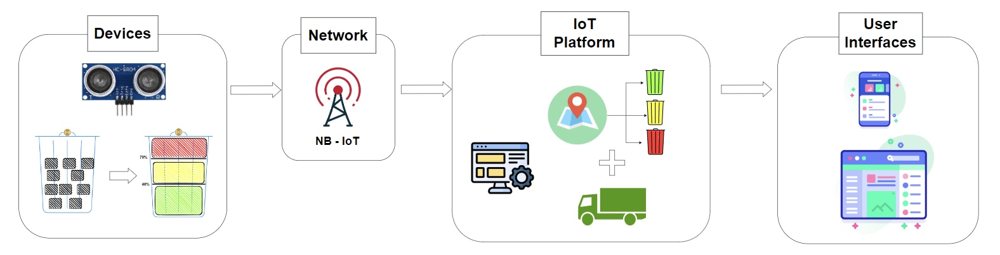
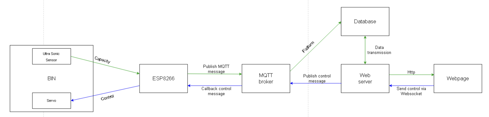

# -Waste-Management-System-In-Smart-Campus

The project was built in 2023 for a scientific research and graduation project of VNU University of Engineering and Technology, Vietnam.

## Contributor:
1. Dinh Quang Lam, VNU University of Engineering and Technology, Vietnam.
2. Vu Hoang Long, VNU University of Engineering and Technology, Vietnam.

## Abstract:
Our project is a complete system with smart devices, connection technology, Platform and User interface. Wastebin network equipped with sensors and use NB-IoT technology to pubish real-time information to a MQTT broker, we process the collected data and use some algorithms on Platform to manage and support time decision making for collecting garbage, to optimalizing the time that wastebin is in use and distributing trash traffic for each area of a campus. 

## Introduction:
Waste management is a thorny issue and a challenge for any city. The waste management systems in use today are either absent or inadequate to meet the needs of the modern city.According to statistics from the Ministry of Natural Resources and Environment [1]: “Currently, Hanoi generates more than 6,000 tons of domestic waste every day on average. In addition, there is a large amount of industrial waste from factories, enterprises and industrial zones. According to experts, with the current momentum, each year, the amount of waste in Hanoi increases by about 5%. It is estimated that by 2030, every day, Hanoi will have to process nearly 1.5 times the current amount of waste. But currently, the city is only applying temporary collection measures, lacking treatment scenarios, no clear division of responsibilities for stakeholders and no synchronous system for collecting and distributing waste to treatment zones in a methodical manner, causing a large backlog of waste that affects the urban environment and citizen's daily life.
.....

## System model

## Pros?
1.The fleet of collection trucks is scheduled to start collecting proactively to save time and promptly treat and dispose of waste to meet the daily usage volume of people.

2.The collection route is routed according to distance and priority, making the route cost-optimized.

3.After a period of collecting data on the traffic of using trash bins, we will redistribute the number of trash bins to each location so that they are optimal.

4.Restore the landscape, keep the surrounding environment green, clean and beautiful, and protect people's health in a sustainable way.

## Operation
....

## Module: 
1. Arduino UNO
2. SIM7020X HAT
3. HC-SR05 
4. Servo motor SG90
.....

